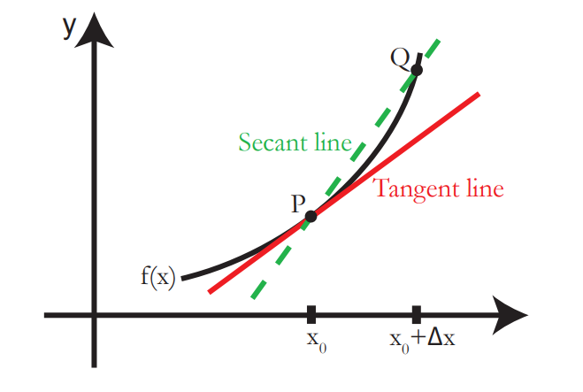

# 一 导数的定义 Derivatices

              

The derivative of $f(x)$ at $x = x_0$ is the slope of tangent line to the graph of $f(x)$ at the point $(x_0,f(x_0))$.
- Tangent line(切线) is the limit of the secant lines(割线) joining points $P=(x_0,f(x_0))$ and $Q$ on the graph of $f(x)$ as $Q$ approaches $P$. 

## Definition(定义):

​	The derivative $f'(x)$ of $f$ at $x_0$ is the slope of the tangent line to $y = f(x)$ at the point $P = (x_0,f(x_0))$.

## Main Formula(公式):

$$
f'(x) =\frac{d}{dx}f= \lim_{\Delta{x}\to0}\frac{\Delta{f}}{\Delta{x}} = \lim_{\Delta{x}\to0}\frac{f(x+\Delta{x})-f(x)}{\Delta{x}}
$$

# 二 极限和连续性 Limits and Continuity

## 极限 Limits

1. Right Limit
   $$
   \lim_{x\to{x}_0^+}f(x) \\
   x>x_0
   $$

2. Lift Limit
   $$
   \lim_{x\to{x}_0^-}f(x) \\
   x<x_0
   $$

## 连续性 Continuity

### Continuity Definition(定义):

A function $f$ is continuous at $x_0$ if 

$$
\lim_{x\to{x_0}}f(x) = f(x_0)
$$

- $\lim_{x\to{x_0^+}}f(x) = \lim_{x\to{x_0^-}}f(x)$. In particular, both of these one side limits exist.
- $f(x_0)$ is defined.
- $\lim_{x\to{x_0^+}}f(x) = \lim_{x\to{x_0^-}}f(x) =  \lim_{x\to{x_0}}f(x) = f(x_0)$ 

### Discontinuity(不连续):

1. **Junp Discontinuity(跳跃间断)：**A jump discontinuity occurs when the **right-hand and left-hand limits exist** but are **not equal**.

   
   $$
   \lim_{x\to{x_0^+}}f(x) \ne \lim_{x\to{x_0^-}}f(x)
   $$
   
2. **Removable Discontinuity(可去间断)：**At a removable discontinuity, the **left-hand and right-hand limits are equal** but either **the function is not defined or not equal** to these limits:

   
   $$
   \lim_{x\to{x_0^+}}f(x) = \lim_{x\to{x_0^-}}f(x) \ne f(x_0)
   $$

3. **Infinite Discontinuities(无穷间断)：**In an infinite discontinuity, the l**eft- and right-hand limits are infinite**; they may be both positive, both negative, or one positive and one negative.

   
   $$
   \lim_{x\to{x_0^+}}f(x) = \lim_{x\to{x_0^-}}f(x) = \pm\infty \\
   or: \\
   \lim_{x\to{x_0^+}}f(x) = \pm\infty \lim_{x\to{x_0^-}}f(x) = \mp\infty
   $$

4. **Other (Ugly) Discontinuities(另类间断)：**The limit $\lim_{x\to0}sin(\frac{1}{x})$  is undefined as $x$ goes to $0$.Here, we say the limit does not exist.

### Differentiable Implies Continuous(可导必连续):

**Theorem：**If $f$ is differentiable at $x_0$, then $f$ is continuous at $x_0$.

**Proof：**
$$
\begin{align}
We~want~to~show~that:& \qquad	
\lim_{x\to{x_0}}f(x)-f(x_0)=0	\\

From~f~is~differentiable:& \qquad
\lim_{x\to{x_0}}\frac{f(\Delta{x}+x_0)-f(x_0)}{\Delta{x}}=f'(x)	\\
\\
So:&
\\

\lim_{x\to{x_0}}f(x)-f(x_0)
&=\lim_{x\to{x_0}}\frac{f(x)-f(x_0)}{x-x_0}(x-x_0)	\\
&=f'(x_0)\cdot0	\\
&=0	
\end{align}
$$

**Remember:**

- When  calculating $\lim_{x\to{x_0}}f(x)$ you never allow $x$ to equal $x_0$.

# 三 计算导数(Caculating Derivatives)

## Specific 三角函数导数

### Limit of Sine and Cosine:

$$
\begin{align}
\lim_{x\to0}\frac{\sin x}{x} &=1	
\\
\\
\lim_{x\to0}\frac{\cos x-1}{x} &=0
\end{align}
$$

### Derivatives of Sine and Cosine:

$$
\begin{align}
\sin 'x &= \frac{d}{dx}\sin x = \cos x
\\
\cos 'x &= \frac{d}{dx}\cos x = -\sin x
\end{align}
$$

**PS:**

- $\sin(a+b)=\sin a \cdot \cos b + \cos a \cdot \sin b$

- $\cos(a+b)=\cos a \cdot \cos b - \sin a \cdot \sin b$

## General